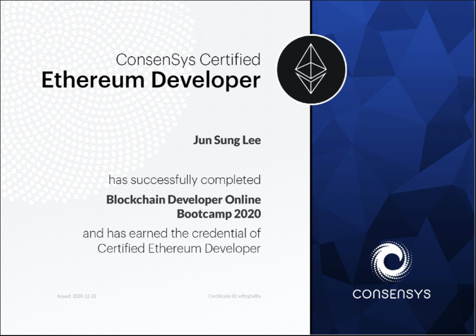

# [Consensys Blockchain Developer Bootcamp 2020](https://junsunglee.com/ConsenSys-Blockchain-Developer-Bootcamp/)

## [Coding Python3 Blockchain From Scratch - blockchain.py](https://github.com/jun-sung/consensys-dev-bootcamp/blob/main/blockchain.py)

- Implemented simple proof-of-work algorithm similar to HashCash
- Deployed Python Flask to communicate with blockchain via REST API
- Used Postman to interact with blockchain (create new transaction, mine new block, return full blockchain)
- Introduction to consensus algorithms (checking for longest chain)

## [Generating Ethereum Accounts in Javascript](https://github.com/jun-sung/consensys-dev-bootcamp/tree/main/ethereum-address-generator-js)

- Introduction to public key cryptography and digital signatures
- Generated a private key, derived public keys from the private key and verified associated accounts

## [Using Geth (Go-Ethereum)](https://github.com/jun-sung/consensys-dev-bootcamp/tree/main/geth-poa-tutorial-master)

- Geth (Go-Ethereum) is a command line interface for running a full Ethereum node implemented in Go
- Used Geth to mine real Ether, transfer funds between addresses, create contracts, send transactions, and explore block history
- Learned to navigate the geth javascript console
- Created private blockchain with proof of work consensus mechanism (test-private-blockchain)

    #### [genesis.json](https://github.com/jun-sung/consensys-dev-bootcamp/blob/main/genesis.json)
    - `config`: defines settings for private blockchain
    - `chainId`: identifies blockchain
    - `alloc`: allows creation of addresses and fills accounts with Ether when the blockchain is initialized (left empty to fill accounts with mined Ether)
    - `difficulty`: defines mining target for discovering a block hash, building on previous block's timestamp and difficulty (value fluctuates to maintain target)
    - `extraData`: optional 32-byte value to embed additional info
    - `gasLimit`: sets chain-wide limit on gas expenditure per block
    - `parentHash`: keccak256 hash of parent block's header
    - `timestamp`: output of Unix `time()` at block's creation (calculated difficulty), allowing verification of block order on chain
    - Created new account
    - Mined private chain
    - Sent transaction
    - Verified balance

- Created private blockchain with proof-of-authority consensus mechanism (geth-poa)
    - Implemented native geth proof-of-authority protocol clique
    - Configured clique via puppeth for creating custom genesis blocks
    - Used bootnode to act as the router/hub between nodes
    - Launched node1 (mining node) with genesis block
    - Launched node2 and node3 to interact with blockchain
    - Sent and verified transactions between nodes

## Writing Smart Contracts

### [Proof of Existence (proof-of-existence)](https://github.com/jun-sung/consensys-dev-bootcamp/tree/main/proof-of-existence)

- Implemented `ganache-cli` for development blockchain
- Hands-on practice using Truffle's `create`, `migrate`, `console`
- Created three versions: one proof, array of proofs, mapping of proofs
- Deployed to Rinkeby testnet via Infura

### [Multi-Signature Wallet (MultiSignatureWallet.sol)](https://github.com/jun-sung/consensys-dev-bootcamp/tree/main/multisig-wallet-exercise)

- Multisignature wallet: an account requiring some m-of-n quorum of approved private keys to approve a transaction before executing
- Learned how to handle complex interactions between multiple users on one contract
- Learned to avoid loops and implement voting
- Audited for attacks on smart contracts
- Learned best practices for implementing `modifiers`, `events`/`emit`, `index` keywords
- Hands-on practice using Truffle's `develop` to interact with contract

### [Exercise: SimpleBank](https://github.com/jun-sung/consensys-dev-bootcamp/tree/main/simple-bank-exercise-jun-sung)

- Setup banking functions with `getBalance`, `enroll`, `deposit`, `withdraw`
- Implemented through `mapping`, `event` references

### [Exercise: SupplyChain](https://github.com/jun-sung/consensys-dev-bootcamp/tree/main/supply-chain-exercise-jun-sung)

- Imitated standard supply chain functions with `ForSale`, `Sold`, `Shipped`, `Received`
- Implemented through `mapping`, `struct`, `enum`, `event`, `modifier`
